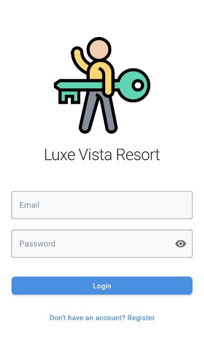
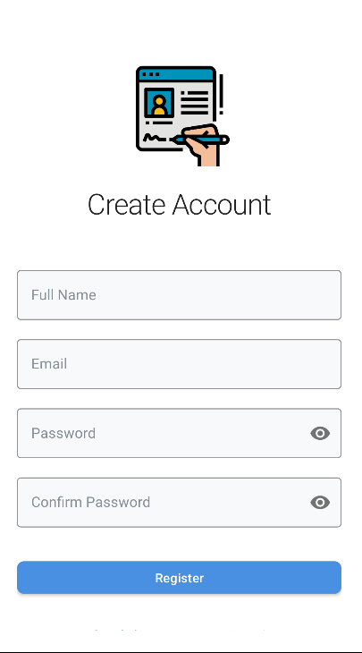
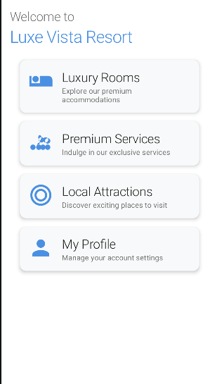
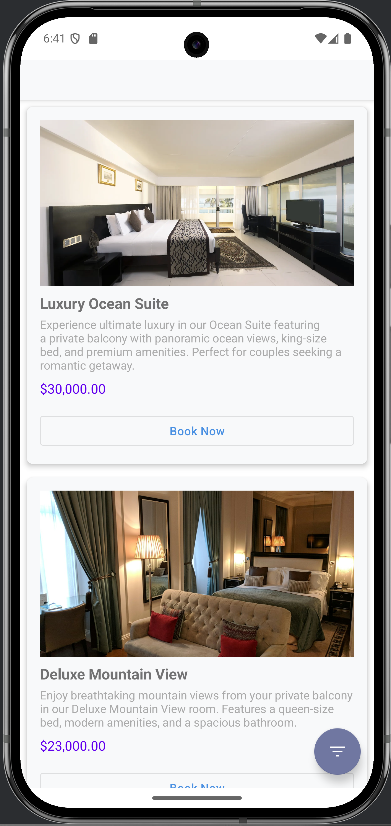
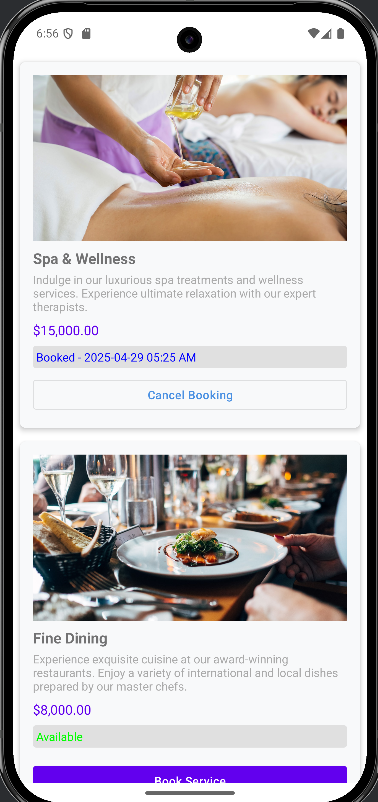
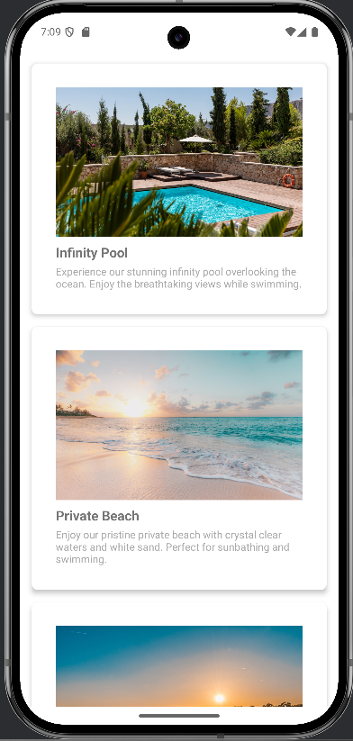
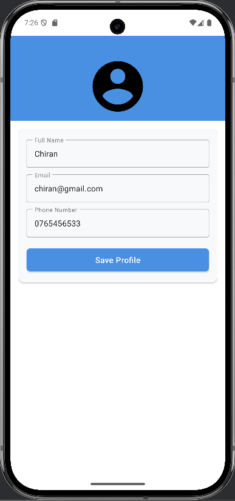

# 🏨 LuxeVista Resort – Hotel Booking Mobile App  
A modern mobile application built for seamless hotel room booking, designed with an elegant UI and smooth user experience.  
This app allows users to browse rooms, services, attractions, authenticate accounts, and manage bookings efficiently.

---

## 🌟 Features

### 🔐 Authentication
- User Login  
- New User Registration  
- Profile Management  

### 🏨 Hotel Booking
- View available rooms  
- Check room details  
- Make reservations  

### 🧭 App Navigation
- Interactive Dashboard  
- Organized sections for Rooms, Services, Profile, Attractions  

### 🏝 Travel & Attractions
- Explore nearby tourist attractions  
- View details and recommendations  

### 🛎 Hotel Services
- Access information about hotel amenities  
- Request services via the app  

---
## 📸 Screenshots  

| Screen | Preview |
|--------|---------|
| Welcome |  |
| Login |  |
| Register |  |
| Dashboard |  |
| Rooms |  |
| Services |  |
| Attractions |  |
| Profile |  |

---

## 🚀 Technologies Used
- **Flutter / Dart**
- Clean UI with reusable widgets
- Local assets for images
- Organized screen-based architecture

---

## 📦 Installation

### 1️⃣ Clone the Repository
```
git clone https://github.com/chiranke-beep/Hotel-Booking-App.git
```
### 2️⃣ Install Dependencies
```
flutter pub get
```
### 3️⃣ Run the App
```
flutter run
```

## 🧑‍💻 Developer

- Chiran Keshawa Weerasekara
- chiranke@gmail.com
- Hotel Booking App – Academic Mobile Application Project

## ⭐ Show Your Support

- If you like this project, please ⭐ the repository!
